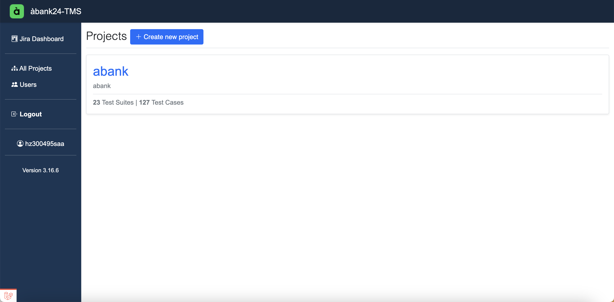
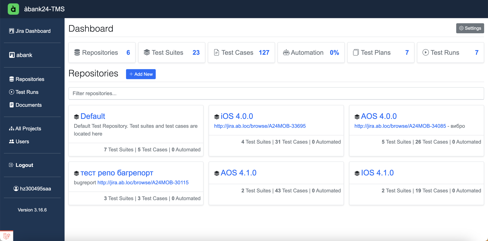
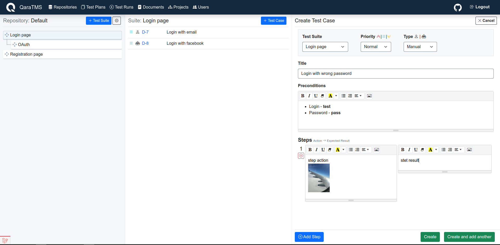
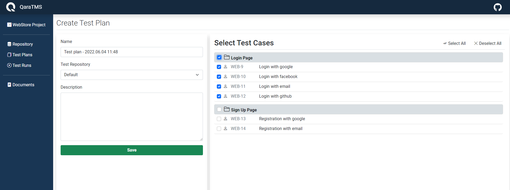
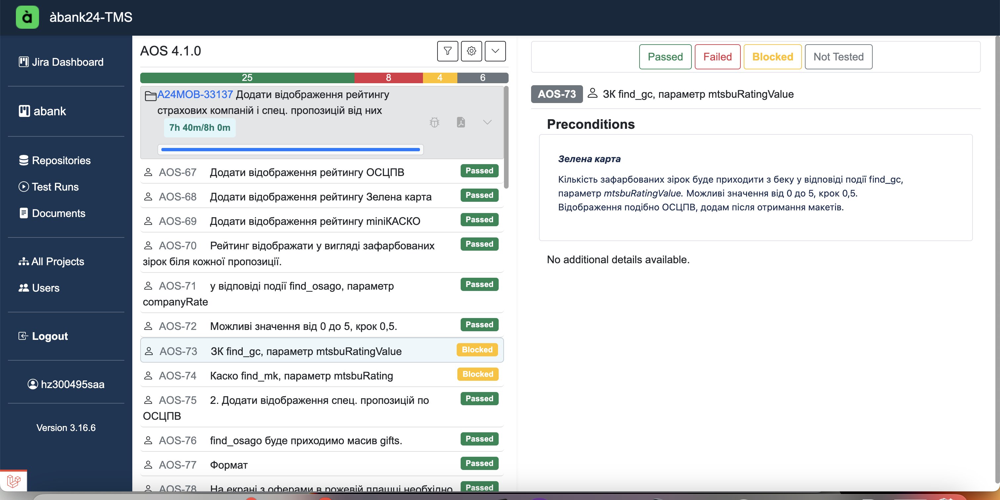
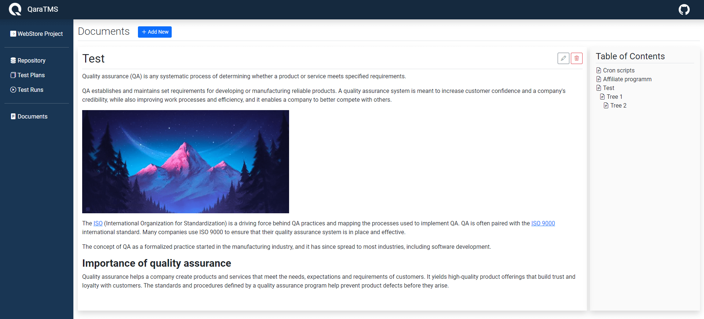

# TMS - Test Management System

**àbank24TMS** is test management software for managing test suites, test cases, test plans, test runs and documentation.
(Powered by QaraTMS https://github.com/a13xh7/QaraTMS)


## Languages and Tools:

<a href="https://php.net/" title="PHP"></a>
<a href="https://laravel.com/" title="Laravel"></a>
<a href="https://www.w3.org/TR/html5/" title="HTML5"></a>
<a href="https://www.w3.org/TR/CSS/" title="CSS3"></a>
<a href="https://jquery.com/" title="jQuery"></a>
<a href="https://developer.mozilla.org/en-US/docs/Web/JavaScript" title="JavaScript"></a>

## Getting Started with docker-compose (quick start)

* Установить docker и docker-compose
* Устновить PHP brew install php или sudo apt install php
* Стянуть git clone (с ссылкой на репозиторий)
* Дать права sudo chmod +x docker-run.sh
* Создать директории:
mkdir -p /Users/admin/docker_data/quara/db    
mkdir -p /Users/admin/docker_data/quara/app    
mkdir -p /Users/admin/docker_data/quara/mysql
* Дать права (путь исправить на свой)
sudo chown -R $(whoami):$(whoami) /Users/admin/docker_data/quara/ 
* Запустить ./docker-run.sh с терминала
* Проверить что все контейнеры поднялись
* Проверить подключение по http://localhost:8075/


Вроде бы как все….


Резервная копия: docker exec -i mysqldb mysqldump -u root -proot qara > ~/Desktop/backup.sql
Восстановить: cat ~/Desktop/backup.sql | docker exec -i mysqldb mysql -u root -proot qara


## Getting Started with Artisan

- You will need to install **php ^8.0.2**, **mysql-8** or **SQLite**, **composer**.
- Pull the project from git repository.
- Create a database named `tms` utf8_general_ci, or you can use SQLite.
- Rename `.env.backup` file to `.env` and fill the database information.
- Run `composer install` or ```php composer.phar install```
- Run `php artisan key:generate`
- Run `php artisan migrate`
- Run `php artisan db:seed --class=AdminSeeder` to create admin user and assign permissions.
- Run `php artisan serve`
- You can now access project at **localhost:8000** 
- Login with default email and password - **admin@admin.com** / **password**
- Go to **Users** page and change default email and password. 

If you are using SQLite:

* Create **database.sqlite** file in **./database** folder
* Rename `.env_sqlite.backup` file to `.env` and fill the database information.


## How to use it
1. Create Project.



2. Create Test Repository. Test suites and test cases are located in test repository. 
   You can create several test repositories for different project modules - web, admin, API, etc.
   

   
3. Add test suites and test cases. 



4. Create test plan, from "TestRun" page 



5. Start new test run.



6. Also, there is documentation module where you can store your project's documentation. 



## Contributing

Please contribute using [GitHub Flow](https://guides.github.com/introduction/flow). Create a branch, add commits, and do a pull request.


## License

QaraTMS is licensed under the [MIT](https://choosealicense.com/licenses/mit/) license.
